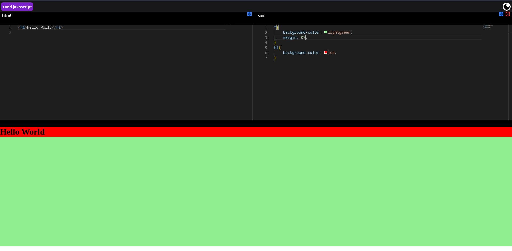

# WebEditor

## Description

This web-based code editor is built using React and Tailwind CSS, providing a responsive and visually appealing user interface. The editor facilitates the addition and deletion of HTML, CSS, JavaScript, and PHP files. Each file can be closed or minimized, allowing users to manage their projects efficiently. The application renders HTML, CSS, JavaScript, and PHP on the client side, ensuring a fast and responsive experience. The editor is particularly useful for practicing coding exercises.

### live deploy - https://webeditor.onrender.com/

## Features

- Built with React and Tailwind CSS.
- Add and delete HTML, CSS, JavaScript, and PHP files.
- Close and minimize individual files.
- Real-time rendering of HTML, CSS, JavaScript, and PHP.
- Client-side execution for enhanced speed.
- Debouncing for improved performance.

## How to Use

### 1. Accessing the Code Editor

- Clone the repository to your local machine.
- Run `npm install` to install dependencies.
- Run `npm start` to launch the development server.
- Open the application in your web browser.

### 2. Adding Files

- Click on the "Add File" button.
- Choose the file type (HTML, CSS, JavaScript, PHP).
- Enter a file name.
- Click "Create" to add the file.

### 3. Managing Files

- Click on a file to open, close, or minimize it.
- Use the "Delete" button to remove a file.

### 4. Previewing Code

- The editor renders and previews HTML, CSS, JavaScript, and PHP in real-time.

## Debouncing for Improved Performance

The code editor incorporates debouncing techniques to optimize performance. This ensures that user input is processed efficiently, reducing unnecessary calls and providing a seamless coding experience.

## Dependencies

- React
- Tailwind CSS
- @monaco-editor/react